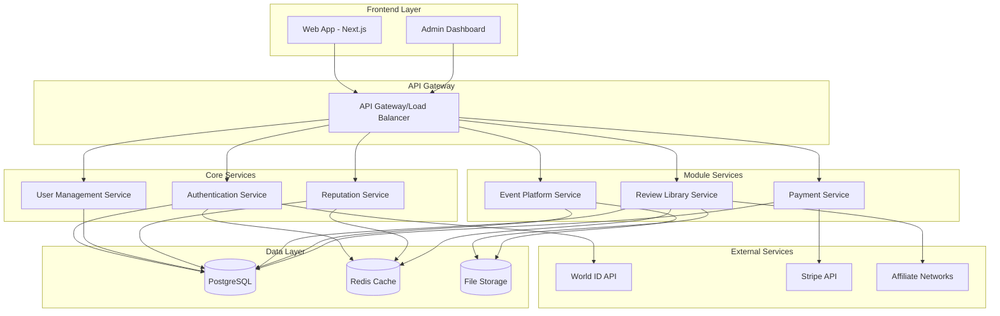

# Design Document

## Overview

Aegis is a Web3-driven trust ecosystem built as a monorepo with three integrated modules sharing a common authentication and reputation foundation. The platform leverages World ID for proof-of-personhood verification and implements a trust flywheel where content drives community engagement, which builds reputation, which enhances content quality.

The system follows a modular architecture where each module can operate independently while sharing core services for authentication, user management, and reputation tracking.

## Architecture

### High-Level Architecture



### Technology Stack

**Frontend:**
- Next.js 14+ with App Router for SSR/SSG and SEO optimization
- TypeScript for type safety
- Tailwind CSS + shadcn/ui for consistent design system
- TanStack Query for server state management
- Zustand for client state management

**Backend:**
- Go with Gin framework for high-performance API services
- PostgreSQL for relational data storage
- Redis for caching and session management
- GORM for database ORM

**Infrastructure:**
- Turborepo for monorepo management
- Vercel for frontend deployment
- Railway/Render for backend services
- AWS S3/Cloudflare R2 for file storage

## Components and Interfaces

### Core Authentication System

**World ID Integration:**
```typescript
interface WorldIDVerification {
  worldId: string;
  nullifierHash: string;
  merkleRoot: string;
  proof: string;
  verificationLevel: 'orb' | 'device';
  verifiedAt: Date;
}

interface User {
  id: string;
  worldIdVerification: WorldIDVerification;
  profile: UserProfile;
  reputation: ReputationScore;
  createdAt: Date;
  updatedAt: Date;
}
```

**Authentication Flow:**
1. User initiates World ID verification through IDKit
2. Frontend receives verification proof
3. Backend validates proof with World ID API
4. System creates/updates user account
5. JWT tokens issued for session management

### Module 1: Review Library

**Core Entities:**
```typescript
interface Product {
  id: string;
  name: string;
  category: ProductCategory;
  description: string;
  affiliateLinks: AffiliateLink[];
  averageRating: number;
  reviewCount: number;
}

interface Review {
  id: string;
  productId: string;
  userId: string;
  rating: number;
  title: string;
  content: string;
  isVerifiedHuman: boolean;
  helpfulVotes: number;
  createdAt: Date;
}

interface AffiliateLink {
  provider: string;
  url: string;
  commission: number;
}
```

**Key Features:**
- SEO-optimized product and review pages
- Verified human badge display
- Affiliate link tracking and commission calculation
- Review helpfulness voting system
- Category-based browsing and search

### Module 2: Event Platform

**Core Entities:**
```typescript
interface Event {
  id: string;
  organizerId: string;
  title: string;
  description: string;
  codeOfConduct: string;
  location: EventLocation;
  dateTime: Date;
  capacity: number;
  ticketPrice: number;
  status: EventStatus;
  attendees: EventAttendee[];
}

interface EventAttendee {
  userId: string;
  registeredAt: Date;
  consentSignature: DigitalConsent;
  paymentStatus: PaymentStatus;
}

interface DigitalConsent {
  worldIdSignature: string;
  codeOfConductHash: string;
  signedAt: Date;
  ipAddress: string;
}
```

**Key Features:**
- Event creation and management interface
- World ID-based digital consent signing
- Integrated payment processing with Stripe
- Attendee management and communication
- Commission tracking for platform revenue

### Module 3: Reputation System

**Core Entities:**
```typescript
interface ReputationScore {
  userId: string;
  trustBadges: number;
  verificationLevel: VerificationLevel;
  lastUpdated: Date;
}

interface ConsentualLink {
  id: string;
  initiatorId: string;
  recipientId: string;
  eventId?: string;
  status: LinkStatus;
  initiatorSignature?: WorldIDSignature;
  recipientSignature?: WorldIDSignature;
  createdAt: Date;
  completedAt?: Date;
}

interface TrustBadge {
  id: string;
  userId: string;
  linkedUserId: string;
  eventContext?: string;
  awardedAt: Date;
}
```

**Key Features:**
- Mutual consent verification system
- Anonymous trust badge display
- Premium feature access control
- Reputation-based event access tiers

## Data Models

### Database Schema

**Users Table:**
```sql
CREATE TABLE users (
    id UUID PRIMARY KEY DEFAULT gen_random_uuid(),
    world_id VARCHAR(255) UNIQUE NOT NULL,
    nullifier_hash VARCHAR(255) UNIQUE NOT NULL,
    verification_level VARCHAR(20) NOT NULL,
    profile_data JSONB,
    created_at TIMESTAMP DEFAULT NOW(),
    updated_at TIMESTAMP DEFAULT NOW()
);
```

**Products Table:**
```sql
CREATE TABLE products (
    id UUID PRIMARY KEY DEFAULT gen_random_uuid(),
    name VARCHAR(255) NOT NULL,
    category VARCHAR(100) NOT NULL,
    description TEXT,
    affiliate_data JSONB,
    average_rating DECIMAL(3,2) DEFAULT 0,
    review_count INTEGER DEFAULT 0,
    created_at TIMESTAMP DEFAULT NOW()
);
```

**Reviews Table:**
```sql
CREATE TABLE reviews (
    id UUID PRIMARY KEY DEFAULT gen_random_uuid(),
    product_id UUID REFERENCES products(id),
    user_id UUID REFERENCES users(id),
    rating INTEGER CHECK (rating >= 1 AND rating <= 5),
    title VARCHAR(255),
    content TEXT,
    helpful_votes INTEGER DEFAULT 0,
    created_at TIMESTAMP DEFAULT NOW(),
    UNIQUE(product_id, user_id)
);
```

**Events Table:**
```sql
CREATE TABLE events (
    id UUID PRIMARY KEY DEFAULT gen_random_uuid(),
    organizer_id UUID REFERENCES users(id),
    title VARCHAR(255) NOT NULL,
    description TEXT,
    code_of_conduct TEXT NOT NULL,
    location_data JSONB,
    event_datetime TIMESTAMP NOT NULL,
    capacity INTEGER,
    ticket_price DECIMAL(10,2),
    status VARCHAR(20) DEFAULT 'draft',
    created_at TIMESTAMP DEFAULT NOW()
);
```

**Consensual Links Table:**
```sql
CREATE TABLE consensual_links (
    id UUID PRIMARY KEY DEFAULT gen_random_uuid(),
    initiator_id UUID REFERENCES users(id),
    recipient_id UUID REFERENCES users(id),
    event_id UUID REFERENCES events(id),
    status VARCHAR(20) DEFAULT 'pending',
    initiator_signature JSONB,
    recipient_signature JSONB,
    created_at TIMESTAMP DEFAULT NOW(),
    completed_at TIMESTAMP
);
```

## Error Handling

### API Error Response Format
```typescript
interface APIError {
  code: string;
  message: string;
  details?: Record<string, any>;
  timestamp: string;
  requestId: string;
}
```

### Error Categories

**Authentication Errors:**
- `WORLD_ID_VERIFICATION_FAILED`: World ID proof validation failed
- `INVALID_TOKEN`: JWT token is invalid or expired
- `INSUFFICIENT_VERIFICATION`: User lacks required verification level

**Business Logic Errors:**
- `DUPLICATE_REVIEW`: User already reviewed this product
- `EVENT_CAPACITY_EXCEEDED`: Event is at maximum capacity
- `INVALID_CONSENT_SIGNATURE`: Digital consent signature is invalid
- `REPUTATION_INSUFFICIENT`: User lacks required trust badges

**System Errors:**
- `DATABASE_CONNECTION_ERROR`: Database connectivity issues
- `EXTERNAL_SERVICE_UNAVAILABLE`: World ID or payment service unavailable
- `RATE_LIMIT_EXCEEDED`: API rate limit exceeded

### Error Handling Strategy

1. **Graceful Degradation**: Non-critical features continue working when dependencies fail
2. **Retry Logic**: Automatic retry for transient failures with exponential backoff
3. **Circuit Breaker**: Prevent cascade failures when external services are down
4. **User-Friendly Messages**: Convert technical errors to actionable user guidance
5. **Monitoring**: Comprehensive error logging and alerting for rapid response

## Testing Strategy

### Unit Testing
- **Backend**: Go's built-in testing package for service logic
- **Frontend**: Vitest for React components and utilities
- **Coverage Target**: 80% code coverage for critical business logic

### Integration Testing
- **API Testing**: Test complete request/response cycles
- **Database Testing**: Test data persistence and retrieval
- **World ID Integration**: Mock World ID responses for consistent testing

### End-to-End Testing
- **Playwright**: Test complete user workflows across modules
- **Critical Paths**: 
  - User registration and World ID verification
  - Product review submission and display
  - Event creation, registration, and consent signing
  - Consensual link creation and trust badge awarding

### Performance Testing
- **Load Testing**: Simulate concurrent users for scalability validation
- **Database Performance**: Query optimization and indexing validation
- **CDN Performance**: Asset delivery speed testing

### Security Testing
- **Authentication**: Verify World ID integration security
- **Authorization**: Test access control across all features
- **Data Protection**: Validate encryption of sensitive data
- **Input Validation**: Test against injection attacks and malformed data

The testing strategy emphasizes automated testing for core functionality while maintaining manual testing for user experience validation. All tests run in CI/CD pipeline with deployment gates based on test results.